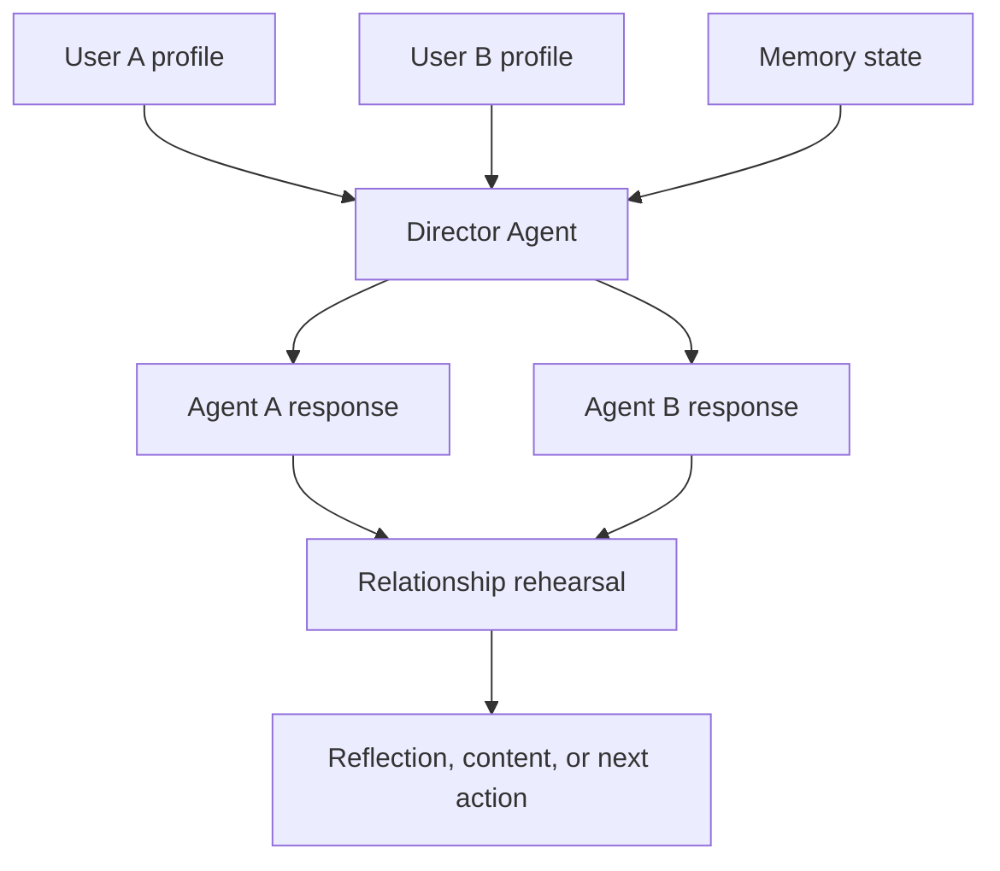
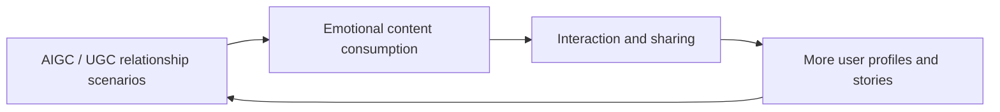

# Moran — AI Native Social Agent

> An AI-native social product concept using personality profiles, multi-agent orchestration, and memory to help users rehearse and reflect on relationships.

## Overview

Moran explores a new kind of social product: instead of matching people only through labels, it uses AI agents to simulate, mediate, and reflect on interpersonal dynamics.

The core idea is to let digital agents represent different users, interact under a director agent, and help people understand relationship possibilities before entering high-cost social interaction.

## Product Problem

Social decisions are high-context and emotionally complex:

- Labels cannot fully describe personality, communication style, or relationship dynamics.
- Users often want to know “what might happen if I say this?” before taking action.
- Social products are often low frequency because matching alone does not create daily emotional value.
- Relationship uncertainty is difficult to discuss directly, but easier to explore through simulation and storytelling.

## Product Concept

Moran uses:

- **Personality Profile:** captures non-label information such as tone, interests, relationship preferences, and communication style.
- **Two user agents:** represent two sides of a potential relationship or conversation.
- **Director Agent:** orchestrates the interaction, manages tone, and prevents unsafe or misleading outputs.
- **Cross-context memory:** preserves relationship state and prior interactions.
- **Emotional content loop:** turns relationship simulation into shareable and discussable content.

## Agent Architecture

## Growth Loop

## My Product Role

- Designed the AI-native social product concept and core interaction flow.
- Proposed the “personality profile + multi-agent orchestration + memory state” structure.
- Reframed a low-frequency matching experience into a higher-frequency emotional content platform.
- Defined “weekly active relationship-interaction users” as a north-star metric balancing relationship value and usage frequency.

## Product Questions Explored

- When should an AI social agent simulate versus ask for more user input?
- How can memory improve relationship continuity without creating privacy or trust risks?
- What makes users trust an AI-mediated social suggestion?
- Can AI turn social uncertainty into a safer rehearsal experience?

## Next Iteration Ideas

- Build a playable prototype for one relationship scenario.
- Add user-controlled memory editing and deletion.
- Add safety boundaries for sensitive emotional advice.
- Design evaluation around user trust, emotional usefulness, and repeated relationship reflection.
